## Prática 02: Introdução ao Logisim-evolution

Nesta prática, vamos utilizar o Logisim-evolution para criar um circuito simples que simula a organização da memória e o funcionamento básico do bloco operacional de uma arquitetura MIPS. Esta prática tem como objetivo familiarizar os alunos com o ambiente de simulação e os conceitos fundamentais da arquitetura MIPS.

### Passo 1: Instalação e Abertura do Logisim-evolution

1. Faça o download do Logisim-evolution a partir do site oficial: [Logisim-evolution](https://github.com/reds-heig/logisim-evolution/releases).
2. Instale o Logisim-evolution em seu computador.
3. Abra o Logisim-evolution.

### Passo 2: Criando o Circuito
#### Configurando os componentes para busca de instruções
1. Crie um novo projeto no Logisim-evolution.
2. Crie o bloco para realizar a busca de instruções no MIPS:
    1. Adicione o `contador de programa (PC)`. 
        - `Memória` -> `registrador`
        - Mude o `rótulo` para PC e a quantidade de `bits de dados` para 32
    2. Adicione uma `memória de instruções`, que será uma memória ROM.
        - `CS3410 Components` -> `MIPS Program ROM`
        - Ligue a saída `Q` do PC na porta `PC` da memória de Instruções
    3. Adicione o somador para realizar PC + 4
        - Em `Aritmética` adicione um `somador` e mude a largura de bits para 32
        - Ligue a saída do PC a uma das entradas do somador
        - Adicione uma constante para fazer a soma com 4. 
            - Aba `Conexão` -> `Constante`
            - Mude a largura de bits para 32 e o valor para 4
        - Ligue a saída do somador à entrada `D` do PC
    4. Ajustes no PC:
        - A entrada `WE` é uma habilitação de escrita. Nós queremos que a escrita esteja habilitada, então vamos adicionar uma fonte (`Conexão` -> `Fonte`) e ligar à entrada `WE`
        - A entrada `>` é a entrada de clock. Adicione o componente clock ( `Conexão`-> `Clock`) e ligue à porta `>`
        - O PC tem uma porta de reset (`R`), para resetar a operação. Adicione um pino (`pino Meta-4`), que você pode encontrar nos botões de atalho ou em `Conexão`-> `Pino`.
    5. Teste o circuito que você criou:
        - Clique o pino que possui o símbolo de uma mão e clique no pino de clock. Você vai perceber que o valor do PC, indicado entre o rótulo e o circuito sobe de 4 em 4.
  
  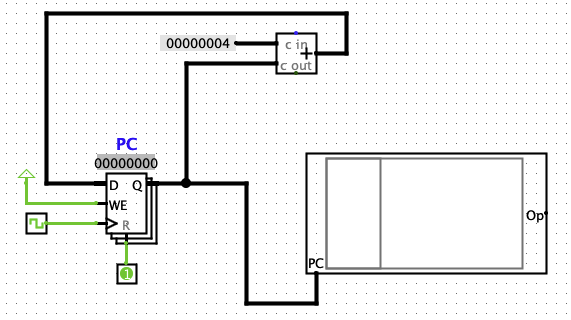
#### Configurando os componentes para instruções do tipo R e I
1. Agora vamos criar o caminho de dados (datapath) para realizar as instruções do tipo R e I, conforme visto na aula passada.
    1. A saída `OP` da memória de instruções contém 32 bits. Como discutimos em aula, cada bit de instrução possui uma representação diferente:
        - Os bits 26-31 sempre representam o opcode.
        - Os bits 25-21 sempre são os bits do registrador `rs`
        - Nas instruções do tipo `R`, o registrador `rt` está ligado aos bits 16-20
        - Nas instruções do tipo `R`, o registrador `rd` está ligado aos bits 11-15
        - Nas instruções do tipo `R`, o registrador `shamt` está ligado aos bits 10-6
        - Nas instruções do tipo `R`, o registrador `funct` está ligado aos bits 0-5
        - Nas instruções do tipo `I`, para instruções do tipo `lw`e `sw`, o registrador `rd` está ligado aos bits 20-16 e o imediato aos bits 0-15
        - Nas instruções do tipo `I`, para instruções do tipo `beq`, o registrador `rd` está ligado aos bits 20-16 e o imediato aos bits 0-15
    2. Por isso, a saída `OP` da memória de instruções precisa ser dividida em 4 caminhos. O distributor é o elemento que recebe o conjunto de bits e divide em diferentes saídas. Adicione um `distributor` (`Conexão`->`Distributor`) e ligue-o à saída `OP` da memória.
        - Altere a largura de bits de **entrada** para 32
        - Altere a largura de **saída** para 4, para informar que teremos 4 saídas
        - Ajuste os bits 0 a 15 para trabalharem com a saída 0
        - Ajuste os bits 16 a 20 para trabalharem com a saída 1
        - Ajuste os bits 21 a 25 para trabalharem com a saída 2
        - Os demais bits irão trabalhar com a saída 3
        - 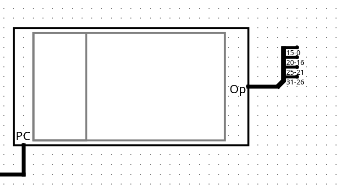
    3. Adicione o banco de registradores do MIPS (`CS3410 Components`->`Register File`) ao projeto. Esse componente é composto pelos seguintes campos:
        - `W` é uma entrada de escrita. Este componente recebe o valor que será escrito nos registradores
        - `A` e `B` são saídas, representando dois registradores que podem ser lidos desse banco, simultanemante
        - `rA` e `rB` contém os endereços dos registradores que serão lidos. Esses endereços possuem 5 bits
        - `rW` contém o endereço do registrador que será escrito
        - `WE` contém a habilitação de escrita (indica se haverá ou não escrita)
        - O sinal de `>` é para ligar a um clock
    4. Ligue a saída dos bits 25-21 (registrador `rs`) à entrada `rA`
    5. Ligue a saída dos bits 20-16 (`rt`) ao registrador `rb`
        - 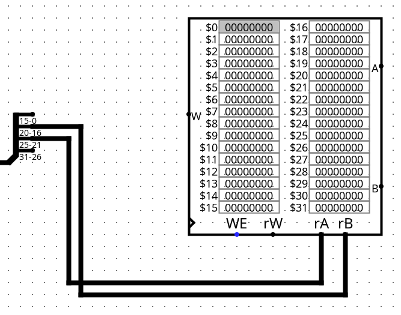
    6. A entrada `rW` ora irá receber os valores do registrador `rt`, ora do registrador `rd`
        - Adicione um novo distributor e mude a largura de dados de entrada para 16 bits. A saída permanece com o valor 2.
        - Ligue o distributor à saída 0-15 do primeiro distributor
        - Ajuste a primeira saída para receber os dados dos bits 0-10 e a segunda saída do 11-15
        - Adicione um multiplexador (`Plexers`->`Multiplexador`)
        - Ajuste os `bits de dados` do multiplexador para o valor 5.
        - Ligue a entrada 1 do multiplexador à entrada 15-11 do segundo distributor e a entrada 0 do multiplexador à entrada os bits 20-16 do primeiro distribuidor
        - Ligue a saída do multiplexador à entrada `rW` do banco de registradores
        - O multiplexador possui uma entrada de seleção, que informa qual será a origem de dados utilizada. Para isso, adicione um pino (pino Meta-4) e o conecte ao pino de seleção do multiplexador
        - Adicione o rótulo`REGDest` ao pino de seleção
        - 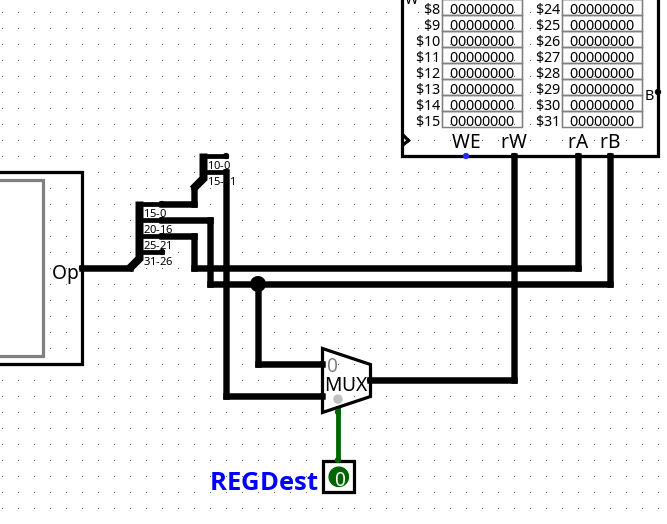
    7. Adicione um pino para controlar o sinal de escrita. Adicioen o rótulo `REGWrite` a esse pino
    8. Adicione a ULA (`CS3410 Components`->`MIPS ALU`)
        - Ligue a entrada `A` da ULA à saída `A` do banco de registradores
        - Ligue a entrada `B` da ULA e a saída `B` do banco de registradores serão conectadas posteriormente.
        - Ligue a saída `C` da ULA à entrada `W` do banco de registradores
        - O campos `OP` da ULA indica qual operação ela irá executar. Essa entrada recebe 4 bits. Adicione um pino e ajuste o `bits de dados` para 4. Conecte a saída do pino ao campo `OP` da ULA. Mude o rótulo deste pino para `ALUOp`
        - 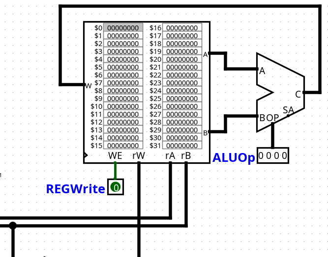
    9.  Ajuste o clock. O dapataph possui vários componentes que se ligam ao clock. Então, vamos usar um componente chamado túnel para organizar melhor o circuito.
        - Retire a conexão do componente `CLK` que adicionamos anteriormente (basta clicar na linha verde e deletar)
        - Retire o ródulo do clock
        - Adicione o componente `Túnel` (`Conexão`->`Túnel`) e ligue ao clock
        - Adicione o rótulo `CLK` ao túnel.
        - Adicine outros dois túneis e os ligue às entradas de clock do banco de registradores e do registrador PC. Todos os túneis precisam ter o mesmo rótulo. O túnel é uma estratégia do simulador para fazer as ligações entre os componentes de maneira mais elegante, reduzindo a quantidade de fios na tela.
        - 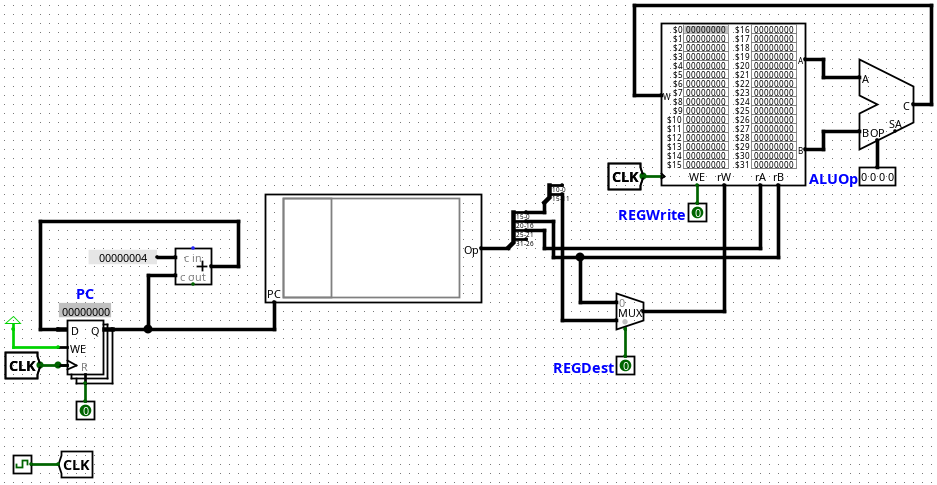
####  Configurando os componentes para intruções de leitura e escrita na memória
   1. Adicione o extensor de bits (`Conexão`->`Extensor de bits`). 
       - Configure-o para receber 16 bits na entrada e extender para 32 bits na saída
       - Conecte o extensor de bits à saída 0-15 do primeiro distribuidor
   2. Adicione um multiplexador e configure-o para receber 32 bits de dados. 
       - Apague a conexão da entrada `B` da ULA com a Saída `B` do banco de registradores
       - Conecte a entrada `0` do do multiplexador à saída `B` do banco de registradores
       - Conecte a entrada `1`  do multiplexador ao extensor de sinais
       - Conecte a saída do multiplexador à entrada `B` da ULA
       - Adicione um pino para conectar ao sinal de controle do multiplexador. Adicione o rótulo `ALUSrc`
       -  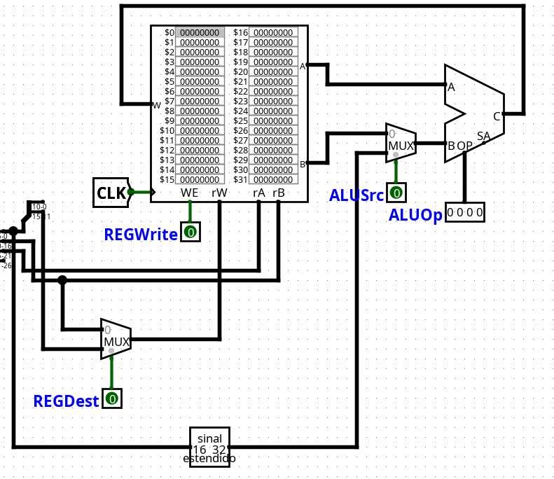

####  Configurando os componentes para intruções de desvio
As instruções de desvio precisam do componente `shit left 2`

   1.  Adicione o componente deslocador (`Aritmética`->`Deslocador`)
       - Configure a largura de dados para 32 bits
       - Conecte a saída do extensor de sinal à porta `entrada de bits` do deslocador (a porta esqueda superior)
       - Adicione uma constante (`Conexão`->`Constante`) para que possamos fazer a multiplicação por 4
       - Altere os bits de dados da constante para 5 e o valor para 2
       - Conecte a constante à outra porta da entrada do deslocador
       - 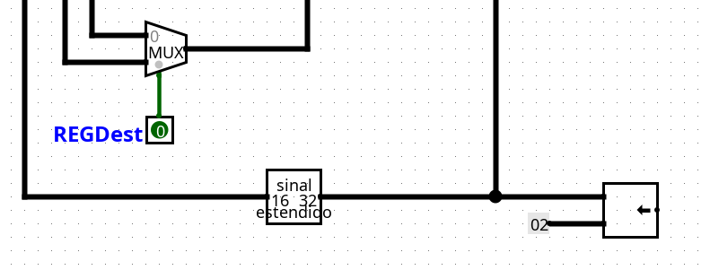
1.  Adicione o somador (`Aritmética`->`Somador`)
    - Altere a lergura de dados para 32 bits
    - Exclua o caminho de saída do somador de `PC+4`
    - Ligue a saída do somador `PC+4` à uma das entradas desse somador (entrada superior)
    - Ligue a outra entrada (inferior) à saída do deslocador adicionado no passo anterior
    - 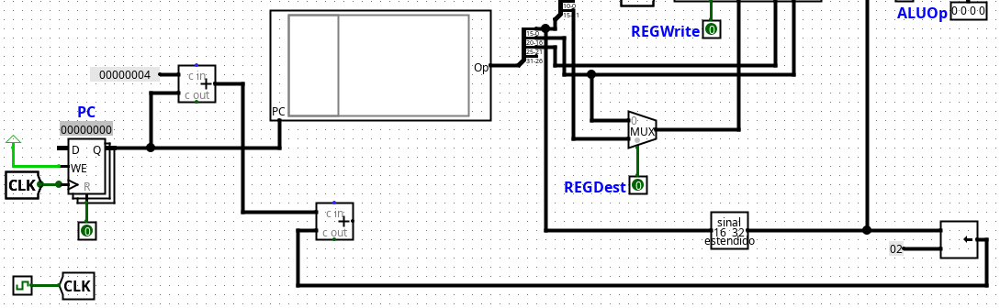
2.  Adicione um multiplexador (`Plexer`->`Multiplexador`)
    - Altere a largura de bits para 32
    - Ligue a entrada 0 à saída do PC+4
    - Ligue a entrada 1 à saída do segundo somador
    - Ligue a saída do multiplexador à entrada ao caminho de retorno para o registrador PC
    - Adicione um pino para controlar a saída do multiplexador 
    - Ligue o pino à porta `OP` e adicione o ródulo `Branch`
    - 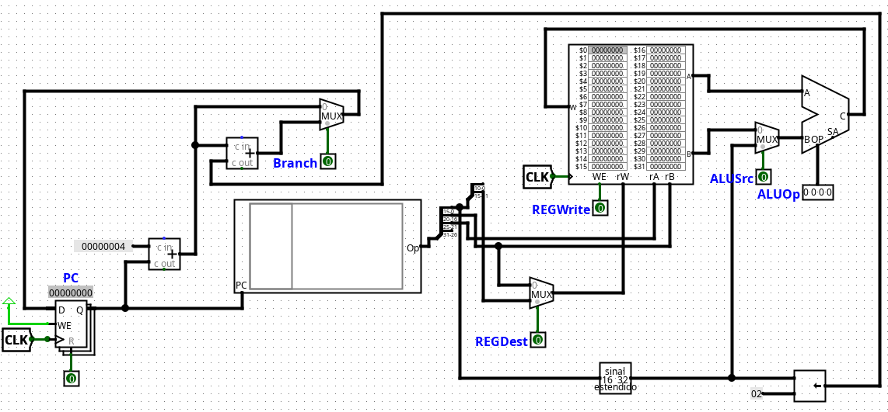

#### Configurando a memória
   1.  Adicione um componente `MIPS RAM` (`CS3410 Components`->`MIPS RAM`) 
   2.  Essa memória possui alguns sinais de controle que precisam ser configurados
        - A entrada `A` deve receber o endereço da memória que será acessado
        - A entrada `D` recebe os dados que serão escritos na memória
        - A saída `D` carrega os dados lidos da memória
        - O `str` é o controle que permite escrita na memória
        - O `ld` é o controle que permite leitura da memória
        - O `sel` controla como a memória será acessada (como uma palavra, ou seja 4 bytes, ou byte-a-byte)
        - O `^` é o controle do clock
        - O `clr` é o controle para limpar a memória (uma espécie de reset)
        - A mentrada de dados `A` só consegue receber 20 bits de dados e a saída da ULA entrega 32 bits, então precisamos dividir saída da ULA em dois grupos. Para isso, adicione mais um distribuidor e ligue-o à saída da ULA
        - Altere os grupos de saída com a seguinte configuaração:
          - Bit0 a Bit19: grupo 0
          - Bit20 a Bit32: grupo 1
        - Ligue a entrada 0-19 do distribuidor à entrada `A` da memória RAM
        - O campo de dados da memória vem da saída `B` do banco de registradores. Ligue essa saí à entrada `D`da memória, conforme a imagem: 
        - 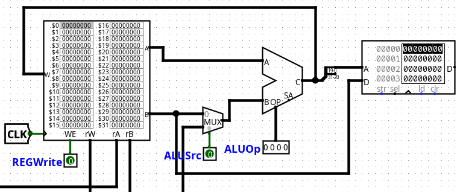
        - A saída da memória é enviada para o banco de registradores. Porém, o banco de registradores pode receber dados tanto da memória quanto o da ULA. Por isso, precisamos adicionar um multiplexador.
        - Adicione um multiplexador ao seu circuito. 
        - Mude os bis de dados para 32
        - Retire a conexão que liga a saída da ULA à entrada `W` do banco de registradores
        - Ligue a saída `D` da memória à entrada 0 do multiplexador e a entrada 1 à saída `C` da ULA.
        - A saída do multiplexador deve ser ligada à entrada `W` do banco de registradores.
        - Adicione um pino para controlar o multiplexador e configure o rótulo para `MemtoReg`
        - 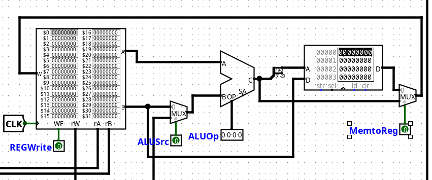
        - Agora vamos configurar os sinais de cotrole da memória. Adicione os seguintes pinos, com seus respectivos rótulos:
          - No sinal de controle de escrita `str` adicione o pino `MemWrite`
          - No sinal de controle de leitura `ld` adicione o pino `MemRead`
          - A entrada de seleção `sel` da memória serve para indicar que as leituras e escritas serão realizadas em forma de palavras (4 bytes). Adicione uma constante e mude os bits de dados para 4. Conecte a constante à entrada `sel`da memória
          - Adicione um túnel para controlar o clock (rótulo `CLK`)
          - Como nós já temos um reset no sistema, vamos criar um túnel para ele
            - Crie u túnel com o rótulo `RST`
            - Desconecte o pino ligado ao reset do PC e ligue-o ao túnel.
            - Crie conecte um túnel com o rótulo `RST` e ligue-o à porta `R` do PC, conforme imagem:
            
             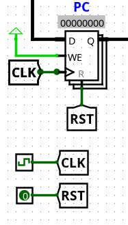
            - Crie mais um túnel `RST` e ligue-o à porta `clr` da memória. 
          - O circuito da memória ficou assim:
            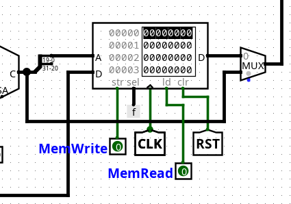
          - 
   


#### Passo 3: Simulando uma instrução simples
1. Os componentes de simulação são limitados quanto às instruções. As instruções são escritas em assembly, mas não é possível nomear os registradores, precisamos usar números para representá-los. Vamos criar um programa com 3 instruções: duas somas e uma subtração: 

    ```assembly
        addu $8, $9, $10
        subu $9, $16, $10
        addu $9, $8, $8
    ```
2. Salve seu código com a extensão `.asm`
2. Vamos adicionar as instruções à memória ROM.
   1. clique no componente MIPS Program ROM do seu circuito 
        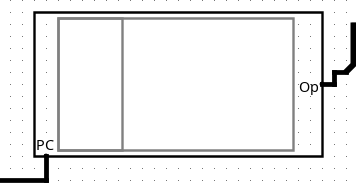

    2. Clique em `MIPS` Program Listing, depois em `Load Program` e carregue o código em assembly.
 3. Você já consegue testar o seu circuito usando o botão `Alterar valores do circuito` (o botão que possui o símbolo da mão) e clicando no clock do sistema.  

O circuito final ficou assim:
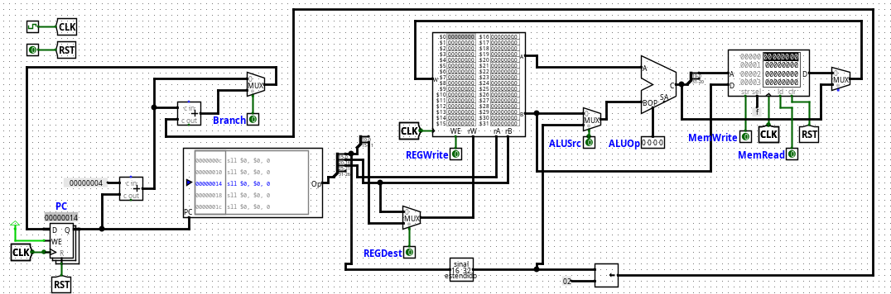

## Ajustes   
Podemos fazer alguns ajustes para melhorar a visualização do circuito. Vamos adicionar algumas saídas para facilitar a visualização. Use o seguinte pino de saída:

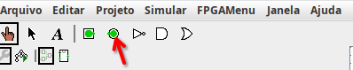

1. Adicione o pino de saída e conecte-o à entrada `rA` do banco de registradores
2. Altere a `Base` de saída para decimal sem sinal e ajuste o bits de dados de acordo com a quantidade de bits do caminho ao qual você está conectando o pino. Neste caso são 5 bits.
3. Adicione mais dois pinos de saída e os conecte à entrada `rB` e `rW`. Sua saída ficará assim:

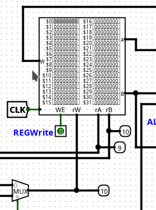

4. Adicione novas saídas ao longo do circuito.
5. Se necessário, adicione novos túneis para organizar o circuito.

[def]: lab